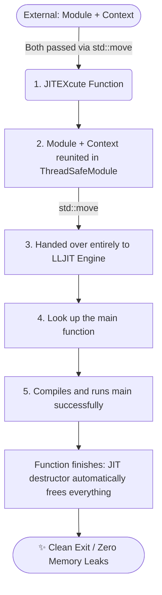

Continuation of  [hell.cpp](./2_hello_cpp.md). Please read  [hell.cpp](./2_hello_cpp.md) first.

`LLJIT` is modern interface in LLVM to build `Just-In-Time` compilers[1].

Note: A **Just-In-Time** (**JIT**) compiler generates machine code dynamically at runtime while the program is executing. In contrast, an **Ahead-Of-Time** (**AOT**) compiler translates source code into machine code before program execution begins[2].

```c
// JIT execution engine headers
#include <llvm/ExecutionEngine/Orc/LLJIT.h>
#include <llvm/Support/TargetSelect.h>
```
| Function | ...| head file | 
| :--- | :--- |:--- |
| InitializeNativeTarget | Target Architecture Detection | TargetSelect.h| 
| InitializeNativeTargetAsmPrinter | Machine Code Emission | TargetSelect.h|
|LLJITBuilder| JIT Engine Execution | LLJIT.h|
|ThreadSafeModule| Thread-safe IR Management | LLJIT.h|

## Flow Chart of Just-In-Time compiler

```c
int JITEXcute( std::unique_ptr<llvm::Module> module ,
               std::unique_ptr<llvm::LLVMContext> context ) {

    std::cout << "\n--- JIT processing ---\n";

    llvm::InitializeNativeTarget();
    llvm::InitializeNativeTargetAsmPrinter();

    // 1. Buid LLJIT instance
    auto JITExpect = llvm::orc::LLJITBuilder().create();
    if (!JITExpect) {
        llvm::errs() << "No JIT Engine: " << JITExpect.takeError() << "\n";
        return 1;
    }
    auto JIT = std::move(*JITExpect);

    // 2. Set the module in a thread safe module pipline and 
    auto TSM = llvm::orc::ThreadSafeModule(std::move(module), 
                            std::move(context) );
    
    // 3. Hand it over to JIT
    // Note: now JIT takes full ownership of the module's lifecycle, so no `delete module` at the end.
    if (auto Err = JIT->addIRModule(std::move(TSM))) {
        llvm::errs() << "Cannot add module to JIT: " << std::move(Err) << "\n";
        return 1;
    }

    // 4. Look up the "main" function
    auto MainSymExpect = JIT->lookup("main");
    if (!MainSymExpect) {
        llvm::errs() << "Cannot find main function: " << MainSymExpect.takeError() << "\n";
        return 1;
    }
    
    // 5.1 Convert the symbol to a function pointer 
    // the original type :  int main() --> int(*)()
    int (*ResultMain)() = MainSymExpect->toPtr<int(*)()>();
    // 5.2 Call main() and get the return value, which should be 0
    // puts("Hello, World!")
    int exitCode = ResultMain(); 
    
    std::cout << "\nJIT is done and return value is: " << exitCode << "\n";
    
    return 0 ;
}
```


The complete example is available in [3_hello_JIT](./3_hello_JIT)

## Reference
[1] LLJIT https://llvm.org/doxygen/group__LLVMCExecutionEngineLLJIT.html

[2] Learning LLVM (Part-3) by sh4dy 2024-11-24 https://sh4dy.com/2024/11/24/learning_llvm_03/

[3] include/llvm/Support/TargetSelect.h File Reference https://llvm.org/doxygen/TargetSelect_8h.html