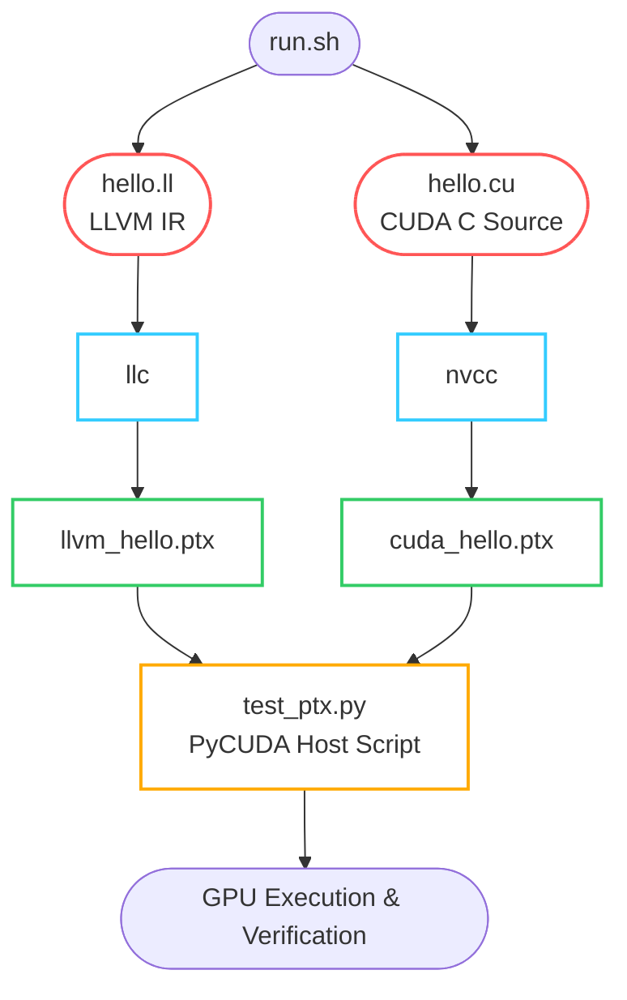

This mini-record documents the process of compiling **LLVM IR** and **CUDA C** source files into NVIDIA **PTX** assembly, and subsequently executing both on a GPU using Python via `pycuda`.

## 1. Compilation Script (`run.sh`)

The following bash script handles the compilation of the LLVM IR file (`hello.ll`) and the CUDA source file (`hello.cu`) into PTX format targeting the `sm_89` (Ada Lovelace) architecture. It then triggers the Python execution script.

```bash
#!/bin/bash

# Path to the custom LLVM llc binary
LLC=/workspace/llvm-bin/bin/llc

# Compile LLVM IR to PTX
${LLC} -march=nvptx64 -mcpu=sm_89 hello.ll -o llvm_hello.ptx

# Compile CUDA C to PTX for comparison
nvcc -ptx hello.cu -o cuda_hello.ptx --gpu-architecture=sm_89

# Execute the verification script
python test_ptx.py
```

## 2. Python Host Code (`test_ptx.py`)

This Python script uses `pycuda` to dynamically load both generated `.ptx` files, extract the compiled kernel function (`hello`), and execute it on the device to verify parity between the LLVM pipeline and the standard NVCC pipeline.

```python
import pycuda.driver as cuda
import pycuda.autoinit

def run_test( ptx_file , func_name , label ):
    # 1. Load the PTX file
    ptx_module = cuda.module_from_file(ptx_file)
    hello_fn = ptx_module.get_function(func_name)

    # 2. Run Function on GPU
    print(f"--- {label} ---")
    hello_fn(block=(1, 1, 1), grid=(1, 1))

    # Wait for the GPU to finish printing before Python exits
    cuda.Context.synchronize() 
    print("------------------")

if __name__ == "__main__":

    # Test execution for NVCC generated PTX
    run_test("cuda_hello.ptx", "hello", "CU")     

    # Test execution for LLVM IR generated PTX
    run_test("llvm_hello.ptx", "hello", "LLVM")
```
output:
```
--- CU ---
Hello World from GPU!
------------------
--- LLVM ---
hello world
------------------
```
The complete example is available in [4_hello_gpu](./4_hello_gpu/)
