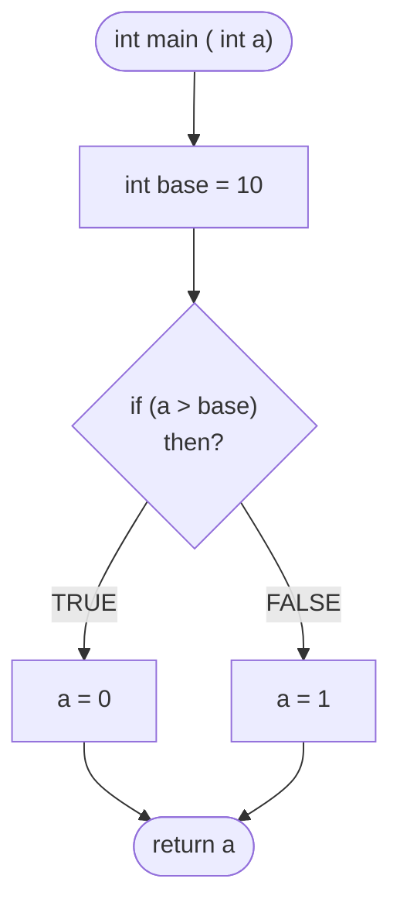
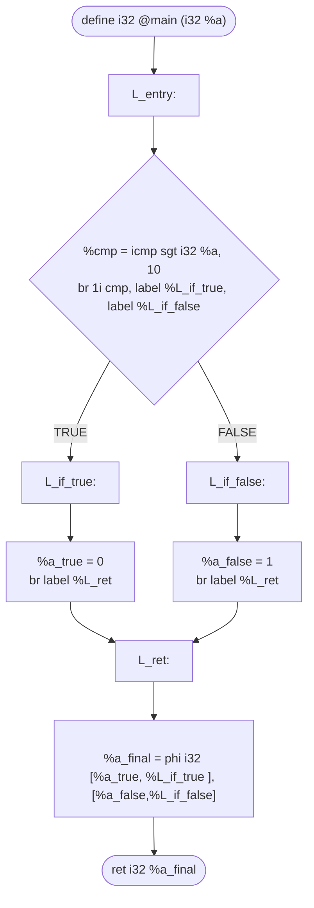

This is a simple pratice to handle LLMV explicit branching (via Static Single Assignment and `phi` nodes) versus optimized, branchless prediction (via the `select` instruction).

- [1. The Explicit Approach: `if-else` and the `phi` Node](#1-the-explicit-approach-if-else-and-the-phi-node)
- [2. :star::star::star: The Optimized Approach: Ternary Operator and select :star::star::star:](#2-the-optimized-approach-ternary-operator-and-select)


## 1. The Explicit Approach: `if-else` and the `phi` Node
Let's start with a standard conditional statement in C. If the input variable `a` is greater than `10`, we set it to `1`; otherwise, we set it to `0`.

```c
int main ( int a ){
    
    if ( a > 10 ) { a = 1 ;
    }else {         a = 0 ;
    }
    return a ;
}
```
### Visualizing the Control Flow
In a traditional compiler passes model, this structure splits our code into distinct basic blocks. 
Notice how both conditional paths eventually converge back to a single return block:


### The LLVM IR Translation
Because LLVM IR uses **Static Single Assignment**(**SSA**), a variable can only be assigned exactly once. We cannot simply overwrite `%a`. 
Instead, LLVM creates unique labels for each path and uses a `phi` instruction to choose the final value based on which basic block the program just executed.

Here, the Control Flow Graph (CFG) explicitly maps out the jumps:

```llvm
;LLVM
; filename: hello.cpp


define i32 @main ( i32 %a ){
L_entry:
    %cmp = icmp sgt i32 %a, 10
    br i1 cmp, label %L_if_true , label %L_if_false

L_if_true:
    ; a = 0
    br label %L_ret

L_if_false:
    ; a = 1
    br label %L_ret

L_ret:
    %a_final = phi i32 [0, %L_if_true ], [1,%L_if_false]

    ret i32 %a_final
}
```

## 2. The Optimized Approach: Ternary Operator and select

When code is structured this tightly, or when the compiler optimizes an explicit `if-else` block, it tries to avoid the overhead of heavy branching. Instead of creating three separate basic blocks (`L_if_true`, `L_if_false`, `L_ret`), LLVM uses the incredibly efficient `select` instruction.
```llvm 
; filename: hello_op.cpp

define i32 @main ( i32 %a ){
L_entry:

    ; Compare %a to 10
    %cmp = icmp sgt i32 %a , 10

    ; Branchless selection: If %cmp is true, pick 0. If false, pick 1.
    %retval = select i1 %cmp, i32 0, i32 1

    ret i32 %retval
}
```
### Why does this matter?

The `select` instruction keeps the code inside a **single basic block**.

`phi` **Nodes** are necessary when variables are assigned across merging control-flow paths (Basic Blocks). They act as a traffic controller saying: ***"Where did you just come from? Cool, take this value."***

`select` **Instructions** act like a clean mathematical choice within a single block. They eliminate branch overhead and result in flatter, faster assembly.

Modern compilers will actively try to convert simple `if-else` structures into branchless `select` operations during optimization phases (like `simplifycfg`) to make the code run like the wind.

The complete example is available [here](./)