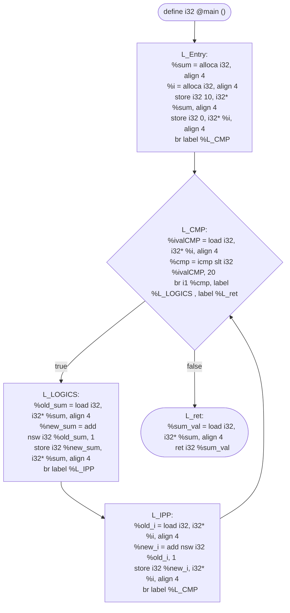
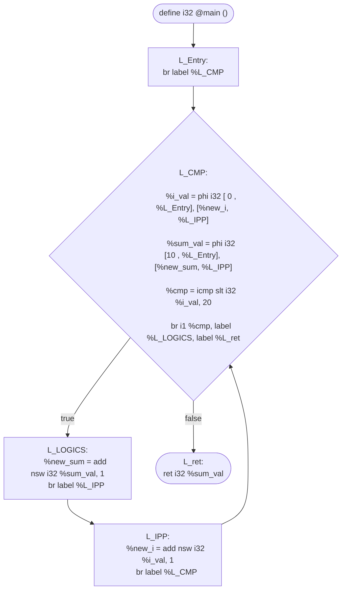

This is a practice of `for` loop in LLVM IR, it helps me to understand that LLVM doesn't have high-level loop constructs.
Instead, it relies on **Basic Blocks** and **Conditional Branches** (`br`) to control the flow.

## The C Source code
Let's have a simple loop that calculates the sum of number from 0 to 19:
```c
int main(){
    int sum = 10 ;
    for ( int i = 0 ; i < 20 ; i++ ){
        sum += 1 ;
    }
    return sum ;
}
```

```c
int main() {
    int sum = 10;
    int i = 0;
    while (i < 20) {
        sum = sum + 1;
        i++;
    }
    return sum; 
}
```
## The LLVM IR Representation

```llvm
define i32 @main (){
    L_Entry:
        %sum = alloca i32, align 4
        %i   = alloca i32, align 4
        store i32 10, i32* %sum, align 4
        store i32 0,  i32* %i,   align 4
        br label %L_CMP

    L_CMP:
        %ivalCMP = load i32, i32* %i, align 4
        %cmp = icmp slt i32 %ivalCMP, 20 
        br i1 %cmp, label %L_LOGICS , label %L_ret

    L_LOGICS:
        %old_sum = load i32, i32* %sum, align 4
        %new_sum = add nsw i32 %old_sum, 1
        store i32 %new_sum, i32* %sum, align 4
        br label %L_IPP
        
    L_IPP:
        %old_i = load i32, i32* %i, align 4
        %new_i = add nsw i32 %old_i, 1 
        store i32 %new_i, i32* %i, align 4
        br label %L_CMP

    L_ret:
        %sum_val = load i32, i32* %sum, align 4 
        ret i32 %sum_val 
}    
```
##

```llvm
define i32 @main (){
    L_Entry:
        br label %L_CMP

    L_CMP:
        %i_val   = phi i32 [ 0 , %L_Entry] [%new_i   , %L_IPP]
        %sum_val = phi i32 [10 , %L_Entry] [%new_sum , %L_IPP]
        %cmp = icmp slt i32 %i_val, 20 
        br i1 %cmp, label %L_LOGICS , label %L_ret

    L_LOGICS:
        %new_sum = add nsw i32 %sum_val, 1
        br label %L_IPP
        
    L_IPP:
        %new_i = add nsw i32 %i_val, 1 
        br label %L_CMP

    L_ret:
        ret i32 %sum_val 
}    
```
