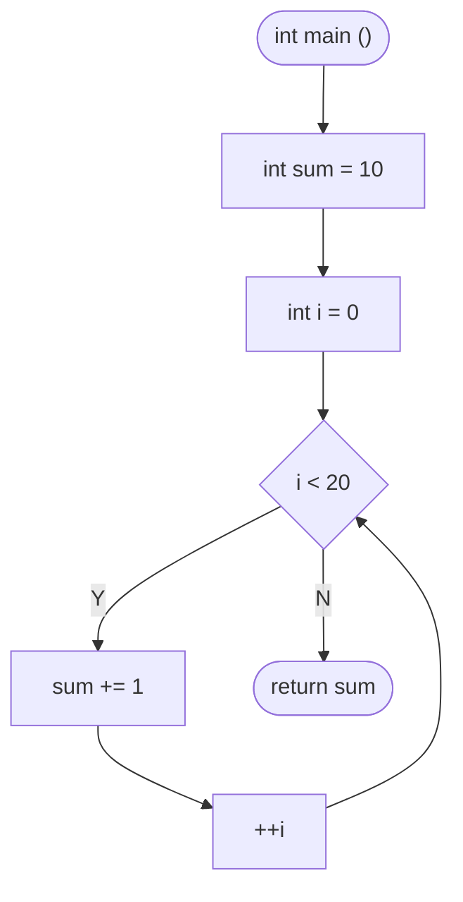
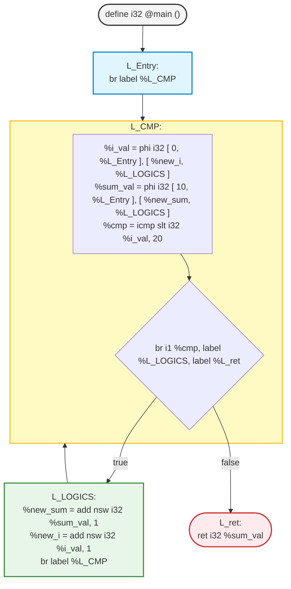

This is a practice of `for` and `while` loops in LLVM IR. 
However, low-level intermediate representations like LLVM IR don't have high-level loop structures. 
Instead, they rely entirely on **Basic Blocks** and **Conditional Branches** (`br`) to control execution flow.

We'll look under the hood by taking a simple C loop and lowering it into LLVM IR in two ways: first, the unoptimized stack-allocated version, and second, the optimized SSA form using `phi` nodes.

- [1. The C Source code](#the-c-source-code)
- [2. The Unoptimized LLVM IR (Stack-Allocated)
](#2-the-unoptimized-llvm-ir-stack-allocated
)
- [3. The Optimized LLVM IR (SSA Form via PHI Nodes) :star:
](#3-the-optimized-llvm-ir-ssa-form-via-phi-nodes
)

## 1. The C Source code
Let's start with a simple loop that calculates a sum. In our C source, we'll implement this pratices in two ways: as a traditional `for` loop, and as its equivalent `while` loop to better visualize the control flow.
Let's have a simple loop that calculates the sum of number from 0 to 19:
### High-Level Logic
```c
int main(){
    int sum = 10 ;
    for ( int i = 0 ; i < 20 ; i++ ){
        sum += 1 ;
    }
    return sum ;
}
```
### The Equivalent Explicit Control Flow
```c
int main() {
    int sum = 10;
    int i = 0;
    while (i < 20) {
        sum = sum + 1;
        i++;
    }
    return sum; 
}
```

## 2. The Unoptimized LLVM IR (Stack-Allocated)

When a compiler first generates LLVM IR without optimizations (like clang -O0), it maps every local variable to a location on the stack using alloca. Memory is explicitly modified using load and store instructions.

While this is less efficient, it is incredibly straightforward to generate because it bypasses the strictness of SSA (Single Static Assignment) tracking for mutable variables.

### The LLVM IR Representation
```llvm
define i32 @main (){
    L_Entry:
        %sum = alloca i32, align 4
        %i   = alloca i32, align 4
        store i32 10, i32* %sum, align 4
        store i32 0,  i32* %i,   align 4
        br label %L_CMP

    L_CMP:
        %ivalCMP = load i32, i32* %i, align 4
        %cmp = icmp slt i32 %ivalCMP, 20 
        br i1 %cmp, label %L_LOGICS , label %L_ret

    L_LOGICS:
        %old_sum = load i32, i32* %sum, align 4
        %new_sum = add nsw i32 %old_sum, 1
        store i32 %new_sum, i32* %sum, align 4
        br label %L_PPI
        
    L_IPP:
        %old_i = load i32, i32* %i, align 4
        %new_i = add nsw i32 %old_i, 1 
        store i32 %new_i, i32* %i, align 4
        br label %L_CMP

    L_ret:
        %sum_val = load i32, i32* %sum, align 4 
        ret i32 %sum_val 
}    
```
### About Memory
#### 1. `%sum` (Register / Variable Name)
- In LLVM IR, names prefixed with `%` represent **local registers** or local variables.
- `%sum` is simply the name assigned to hold the pointer (the address) of our allocated memory.

#### 2. `alloca` (Memory Allocation Instruction)
- `alloca` stands for **Allocate on Stack**.
- Its purpose is to allocate a block of space on the CPU's **stack memory**. 
- This typically corresponds to the declaration of a local variable in high-level languages (like C). 
- When the function exits, this memory is automatically freed.

#### 3. `i32` (Data Type)
- `i32` represents a **32-bit** integer, which occupies exactly **4** bytes of space.
- Therefore, `alloca i32` means: "Please reserve a slot on the stack that can hold a 32-bit integer."
- Note: `%sum` itself does not store the integer value; instead, it stores the memory address of this slot. In other words, the actual type of `%sum` is a **pointer** (`i32*`).

#### 4. `align 4` (Memory Alignment Setting)
- This forces the starting address of the memory block to be a multiple of **4**.
- This ensures **maximum efficiency**, allowing the CPU to read from or write to this variable in a single memory access cycle.

### Why is Memory Alignment Necessary?
When modern CPUs read memory, they do not read it byte by byte. 
Instead, they read memory in large chunks called a "**Memory Word**" (typically 4 bytes on a 32-bit system, and 8 bytes on a 64-bit system).
#### 1. Aligned Scenario (High Efficiency)
If a 4-byte integer happens to be placed perfectly within a grid that is a multiple of 4 (aligned to 4 bytes), the CPU only needs to execute a single memory read instruction to fetch the entire integer.
#### 2. Unaligned Scenario (Low Efficiency)
If memory is not properly aligned, this 4-byte integer might straddle the boundary between two memory words. 
When this happens, the CPU must:
- Read the first memory block.
- Read the second memory block.
- Combine the data from both sides using **bit-shifting** and **logical OR** operations.
This extra overhead slows down memory access speed. 
On certain strict hardware architectures, accessing unaligned memory can even directly trigger a system crash known as an **Alignment Fault**.

### About Overflow 
- `nsw` (**No Signed Wrap**)：Ensures that no overflow or wrap-around behavior will happen.
- `nuw` (**No Unsigned Wrap**)：Specifically for unsigned integers, it guarantees that signed-equivalent overflow will not happen.

## 3. The Optimized LLVM IR (SSA Form via PHI Nodes) 

It is slow to hit the stack with `load` and `store`constantly. 
### This for loop code is optimized by lifting variables into virtual **register**s (a process called **mem2reg**).

However, LLVM IR enforces **Single Static Assignment**(**SSA**), meaning a register can only be assigned exactly once. 
Then, the loops naturally modify variables iteratively, we use `phi` nodes.
A `phi` instruction selects a value depending on which basic block control just flowed from.

```llvm
define i32 @main (){
    L_Entry:
        br label %L_CMP

    L_CMP:
        %i_val   = phi i32 [ 0 , %L_Entry] [%new_i   , %L_LOGICS]
        %sum_val = phi i32 [10 , %L_Entry] [%new_sum , %L_LOGICS]
        %cmp = icmp slt i32 %i_val, 20 
        br i1 %cmp, label %L_LOGICS , label %L_ret

    L_LOGICS:
        %new_sum = add nsw i32 %sum_val, 1   
        %new_i = add nsw i32 %i_val, 1 
        br label %L_CMP

    L_ret:
        ret i32 %sum_val 
}    
```
### How to read the PHI Nodes:

- `%i_val`: If we come straight from `%L_Entry`, initialized `i` is `0`. If we loop back from `%L_IPP`, `i` takes the value of `%new_i`.

- By keeping these trackings inside registers, we completely eliminate memory overhead, letting the CPU keep everything in hardware registers.

### Wrap Up

LLVM IR achieves complex control flows using surprisingly simple primitives. 
By stripping away for and while keywords, we see that **loops are ultimately just the networks of basic blocks pointing to one another via conditional jumps**.

The complete code and experimental files are available [here](./).

