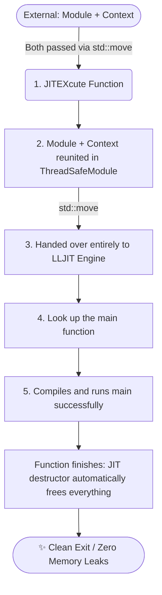

This post is a continuation of [Generating my First LLVM IR: A Minimal Example](./5_simple_cpp_1/readme.md). If you haven't read that yet, please check [this](./5_simple_cpp_1/readme.md) out first! 

`LLJIT` is modern interface in LLVM to build `Just-In-Time` compilers[1].

**A Quick Refresher**: A **Just-In-Time** (**JIT**) compiler generates machine code dynamically at runtime while the program is executing. In contrast, an **Ahead-Of-Time** (**AOT**) compiler translates source code into machine code before program execution begins[2].

To implement a JIT execution engine in C++, we need to include the following headers:
```c
// JIT execution engine headers
#include <llvm/ExecutionEngine/Orc/LLJIT.h>
#include <llvm/Support/TargetSelect.h>
```

## Flow Chart of Just-In-Time compiler
The lifetime and ownership of the LLVM Module and Context follow a specific pipeline to ensure safe dynamic execution:

## Code Implementation: jitExecute
Below is the function to initialize the JIT engine, add our generated IR module, and run the compiled code.
```c
int JITEXcute( std::unique_ptr<llvm::Module> module ,
               std::unique_ptr<llvm::LLVMContext> context ) {

    std::cout << "\n--- JIT processing ---\n";

    llvm::InitializeNativeTarget();
    llvm::InitializeNativeTargetAsmPrinter();

    // 1. Buid the LLJIT instance
    auto JITExpect = llvm::orc::LLJITBuilder().create();
    if (!JITExpect) {
        llvm::errs() << "No JIT Engine: " << JITExpect.takeError() << "\n";
        return 1;
    }
    auto JIT = std::move(*JITExpect);

    // 2. Wrap the module in a thread-safe module pipline 
    auto TSM = llvm::orc::ThreadSafeModule(std::move(module), 
                            std::move(context) );
    
    // 3. Hand ownership over to the JIT engine
    // Note: The JIT engine now takes full responsibility for the module's lifecycle.
    // There is no need to manually delete or manage the module after this point.
    if (auto Err = JIT->addIRModule(std::move(TSM))) {
        llvm::errs() << "Cannot add module to JIT: " << std::move(Err) << "\n";
        return 1;
    }

    // 4. Look up the "main" function
    auto MainSymExpect = JIT->lookup("main");
    if (!MainSymExpect) {
        llvm::errs() << "Cannot find main function: " << MainSymExpect.takeError() << "\n";
        return 1;
    }
    
    // 5.1 Cast the symbol address to the matching C-style function pointer
    // Signature mapping: int main() -> int(*)()
    int (*ResultMain)() = MainSymExpect->toPtr<int(*)()>();
    // 5.2 Call main() and get the return value, which should be 0
    // 5.2 Execute the function and capture the exit code
    int exitCode = ResultMain(); 
    
    std::cout << "\nJIT is done and return value is: " << exitCode << "\n";
    
    return 0 ;
}
```

Here is a quick breakdown of the core functions and classes we will be using:
| Function | ...| head file | 
| :--- | :--- |:--- |
| InitializeNativeTarget | Target Architecture Detection | TargetSelect.h| 
| InitializeNativeTargetAsmPrinter | Machine Code Emission | TargetSelect.h|
|LLJITBuilder| JIT Engine Execution | LLJIT.h|
|ThreadSafeModule| Thread-safe IR Management | LLJIT.h|

## Compilation Flag Updates
When compiling this setup, make sure your `Makefile` explicitly links the required ORC JIT and native target libraries from LLVM. Update your `LDFLAGS` as follows:
```Makefile
LDFLAGS  := $(shell $(LLVM_CONFIG) --ldflags --libs core support orcjit native --system-libs)
```


The complete example is available [here](./)

## Reference
[1] LLJIT https://llvm.org/doxygen/group__LLVMCExecutionEngineLLJIT.html

[2] Learning LLVM (Part-3) by sh4dy 2024-11-24 https://sh4dy.com/2024/11/24/learning_llvm_03/

[3] include/llvm/Support/TargetSelect.h File Reference https://llvm.org/doxygen/TargetSelect_8h.html
